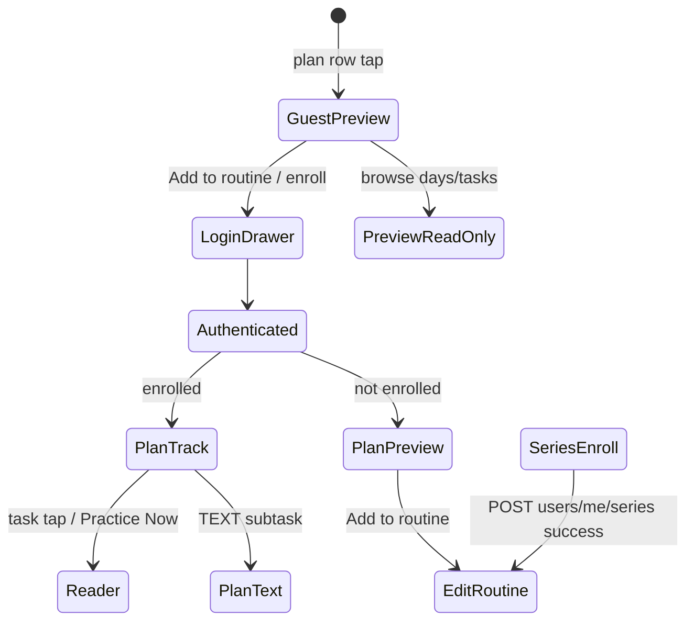

# Flutter — Series, Plans & Connect Route Map

| | |
|---|---|
| **Status** | Research complete |
| **Last updated** | 2026-06-22 |
| **Flutter baseline** | `WeBuddhist-app/lib` |
| **Router** | `lib/core/config/router/app_router.dart` |

---

## 1. Bottom shell

Four tabs in `main_navigation_screen.dart` (no dedicated routes — widgets swapped at `/home`):

| Tab index | Widget | Label |
|-----------|--------|-------|
| 0 | `HomeScreen` | Home |
| 1 | `PracticeScreen` | Practice |
| 2 | `ConnectScreen` | Connect |
| 3 | `MeScreen` | Me |

---

## 2. Route table

### Series

| Path | Route name | Screen | Extra / params | Auth |
|------|------------|--------|----------------|------|
| `/home/series/:id` | `home-series-detail` | `SeriesDetailScreen` | `extra['series']` optional (avoids refetch) | Guest OK |
| `/home/series/:id/info` | `home-series-info` | `SeriesInfoScreen` | `extra['series']` required | Guest OK |

**Source:** `series_detail_screen.dart` uses `PlanListView` with `seriesId` + `series`.

### Plans

| Path | Route name | Screen | Extra | Auth |
|------|------------|--------|-------|------|
| `/home/plans/:tag` | `home-plans` | `PlanListScreen` | tag param | Guest OK |
| `/home/plans/:tag/preview` | `home-plan-preview` | `PlanPreviewDetails` | `plan`, `seriesId?` | Guest OK |
| `/practice/plans/preview` | `practice-plan-preview` | `PlanPreviewDetails` | `plan`, `seriesId?` | Guest OK |
| `/practice/plans/info` | `practice-plan-info` | `PlanInfo` | `plan` | Protected |
| `/practice/plans/info/details` | `practice-plan-info-details` | `PlanDetails` | `UserPlansModel`, `selectedDay`, `startDate` | Protected |
| `/practice/details` | `practice-plan-details` | `PlanDetails` | `UserPlansModel`, `selectedDay`, `startDate` | Logged-in |
| `/plan-text/:subtaskId` | `plan-text` | `PlanTextScreen` | `NavigationContext` | Guest OK |

### Practice / routine

| Path | Route name | Screen |
|------|------------|--------|
| `/practice` | `practice` | `PracticeScreen` |
| `/practice/edit-routine` | `edit-routine` | `EditRoutineScreen` — accepts `initialPlan`, `enrollSeriesId` |
| `/practice/edit-routine/select-plan` | `select-plan` | `SelectPlanScreen` (superseded by imperative `SelectSessionScreen`) |
| `/practice/edit-routine/select-recitation` | `select-recitation` | `SelectRecitationScreen` |

### Connect / community

| Path | Route name | Screen | Notes |
|------|------------|--------|-------|
| `/home/group/:groupId` | `home-group-profile` | `GroupProfileScreen` | Org/community profile |
| *(none)* | — | `GroupSearchScreen` | `MaterialPageRoute` from `ConnectHeader` |
| *(none)* | — | `MyGroupsScreen` | `MaterialPageRoute` from `MyGroupsSection` |

### Legacy paths (broken — do not migrate)

| Path used in code | Expected by router | Status |
|-------------------|-------------------|--------|
| `/plans/info` | `/practice/plans/info` | Orphaned `PlansScreen` |
| `/plans/details` | `/practice/details` | Orphaned `PlansScreen` |

---

## 3. Navigation workflows

### 3.1 Home → Series → Plan

```
HomeScreen
  └─ tap featured series
       └─ /home/series/:id (SeriesDetailScreen)
            ├─ FeaturedPlanCard tap (body) → /home/series/:id/info (SeriesInfoScreen)
            │    └─ group row → /home/group/:groupId
            ├─ FeaturedPlanCard Enroll (seriesId set)
            │    └─ POST /users/me/series → /practice/edit-routine?enrollSeriesId
            └─ PlanListItem tap
                 ├─ locked (future start_date) → no navigation
                 ├─ enrolled → /practice/details
                 └─ not enrolled → /practice/plans/preview
```

**Plan row lock rule** (`plan_list_view.dart`):

```dart
isLocked = plan.startDate != null && plan.startDate!.isAfter(DateTime.now());
```

Locked rows: 45% opacity, lock icon, tap disabled.

### 3.2 Plan screen variants

| Screen | File | Model | When shown |
|--------|------|-------|------------|
| **Preview** | `plan_preview_details.dart` | Catalog `Plan` | Guest or not enrolled; read-only tasks |
| **Track** | `plan_details.dart` | `UserPlansModel` | Enrolled user; task toggles, day completion |
| **Info** | `plan_info.dart` | Catalog `Plan` | Metadata + per-plan enroll CTA |

**Navigation from series plan row** (`_navigateToPlan`):

- Enrolled → `/practice/details` with `userPlan`, `selectedDay`, `startDate`
- Not enrolled → `/practice/plans/preview` with `plan`, optional `seriesId`

### 3.3 Plan state machine



### 3.4 Connect → Group profile

```
ConnectScreen (tab)
  ├─ DiscoverGroupCard → /home/group/:groupId
  ├─ MyGroupsSection tile → /home/group/:groupId
  ├─ search icon → GroupSearchScreen (push)
  └─ See all → MyGroupsScreen (push)

GroupProfileScreen
  ├─ Join / Follow → POST /author/groups/{id}/join|follow
  ├─ Practices tab → series rows → /home/series/:id
  └─ About tab (when descriptionLong present)
```

**Note:** Flutter has **no separate creator profile route**. Mockup "ITCC" org maps to `GroupProfileScreen`. Home string `creator_featured_plan` is label copy only.

---

## 4. Enrollment flows

Three distinct paths (commonly confused):

| Flow | Trigger | API | Post-success |
|------|---------|-----|--------------|
| **Series enroll** | Enroll on `FeaturedPlanCard` when `seriesId` set | `POST /users/me/series` `{ series_id }` | `edit-routine` with `enrollSeriesId` |
| **Plan enroll** | Enroll on `PlanInfo` | `POST /users/me/plans` `{ plan_id }` via `EventEnrollmentService` | Dialog; navigate Practice or plan details |
| **Routine add** | "Add to Routine" on preview | Routine sync (backend may auto-enroll) | `edit-routine` with `initialPlan` |

### Series enroll details

**Datasource:** `series_remote_datasource.dart`

- `POST /users/me/series` body: `{ "series_id": "<uuid>" }`
- Optional backend fields: `auto_enroll_next` (default true), `start_immediately` (default false)
- Treats HTTP **409 as success** (already enrolled)
- Success → invalidates `userSeriesEnrollmentsProvider`, `myPlansPaginatedProvider`

**UI states** (`FeaturedPlanCard`):

- Guest → `LoginDrawer`
- Loading → `CircularProgressIndicator` on button, `onPressed: null`
- Hide button when: plan enrolled, series enrolled, or enrollment data loading
- Error → red `SnackBar`

**Enrollment check:**

- Series: `userSeriesEnrollmentsProvider` → `Set<String>` of series IDs
- Plan: `myPlansPaginatedProvider` OR presence in user routine

### Plan enroll (PlanInfo)

Separate from series enroll — single plan subscription + notification metadata.

---

## 5. Plan UI building blocks (Flutter)

| Widget | File | Purpose |
|--------|------|---------|
| `DayCarousel` | `day_carousel.dart` | Horizontal day selector; checkmarks; future-day lock |
| `ActivityList` | `activity_list.dart` | Enrolled task rows with completion toggles |
| `PreviewActivityList` | `preview_activity_list.dart` | Read-only preview tasks |
| `EnrolledPlanStatusIndicator` | `enrolled_plan_status_indicator.dart` | "On track" / missed-days badge on series plan rows |
| `MissedDaysBadge` | `missed_days_badge.dart` | Missed day count; tap → first missed day |
| `DayCompletionBottomSheet` | `day_completion_bottom_sheet.dart` | Day complete celebration |
| `PlanNavigator` | `plan_navigation/plan_navigator.dart` | Prev/play/next reader bar |

### Day carousel lock logic

When `lockFutureDays: true`:

```dart
isDisabled = isFuture && dayNumber > previewUnlockDayCount;
```

`previewUnlockDayCount` from `SeriesPlanUtils.firstPlanPreviewDayCount` (= **10**) for the **first plan in a series** only.

### Enrolled plan row status ("On track")

From `enrolled_plan_status_indicator.dart`:

1. Future plan (today < start) → nothing
2. All days complete → nothing
3. Ongoing + zero missed → `OnTrackBadge`
4. Ongoing or past with missed → `MissedDaysBadge`

Uses `GET /users/me/plans/{id}/days/completion_status`.

---

## 6. Legacy / orphaned (document only)

| Item | Issue |
|------|-------|
| `PlansScreen` (My Plans / Browse tabs) | Not in GoRouter |
| `SelectPlanScreen` route | Superseded by `SelectSessionScreen` |
| `practice-plan-info-details` | Registered; no callers found |
| `practice-plan-author` | Commented out in router |
| Series unenroll | Backend `DELETE /users/me/series/{id}` exists; no Flutter datasource |

---

## 7. Key file index

| Area | Path |
|------|------|
| Router | `lib/core/config/router/app_router.dart` |
| Series detail | `lib/features/home/presentation/screens/series_detail_screen.dart` |
| Series info | `lib/features/home/presentation/screens/series_info_screen.dart` |
| Plan list (shared) | `lib/features/home/presentation/widgets/plan_list_view.dart` |
| Series enroll API | `lib/features/home/data/datasource/series_remote_datasource.dart` |
| Series enroll state | `lib/features/home/presentation/providers/series_enrollment_provider.dart` |
| Plan preview | `lib/features/plans/presentation/widgets/plan_preview/plan_preview_details.dart` |
| Plan track | `lib/features/plans/presentation/widgets/plan_track/plan_details.dart` |
| Plan info | `lib/features/plans/presentation/plan_info.dart` |
| Connect tab | `lib/features/connect/presentation/screens/connect_screen.dart` |
| Connect API | `lib/features/connect/data/datasource/connect_remote_datasource.dart` |
| Group profile | `lib/features/group_profile/presentation/screens/group_profile_screen.dart` |
| Group profile body | `lib/features/group_profile/presentation/widgets/group_profile_body.dart` |
| Group API | `lib/features/group_profile/data/datasource/group_profile_remote_datasource.dart` |
