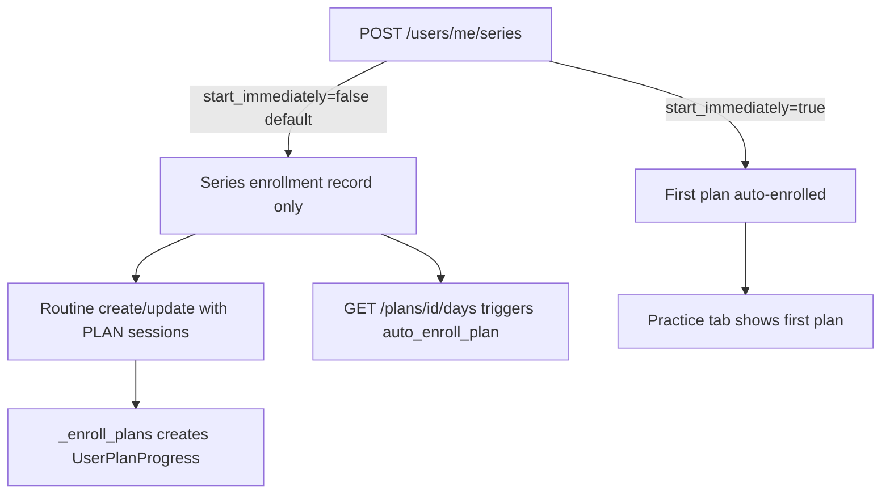

# Open Questions — Series, Plans & Connect

| | |
|---|---|
| **Status** | All items resolved via backend API |
| **Last updated** | 2026-06-22 |
| **Source of truth** | [`WeBuddhist-Backend`](../../../WeBuddhist-Backend) endpoint contracts |

---

## 1. Post-series-enroll navigation

**Resolved via API**

| Source | Behavior after successful series enroll |
|--------|----------------------------------------|
| Mockup (`series_page`) | User stays on series or sees enrolled state; implied move to Practice |
| Flutter | `context.pushNamed('edit-routine', extra: { enrollSeriesId })` — routine builder with series prefill |
| Backend | `POST /users/me/series` creates series enrollment only (default `start_immediately=false`) |

**Backend behavior** ([`plan_users_service.py`](../../../WeBuddhist-Backend/pecha_api/plans/users/plan_users_service.py) `enroll_user_in_series`, [`UserSeriesEnrollRequest`](../../../WeBuddhist-Backend/pecha_api/plans/users/plan_users_response_models.py)):

- Defaults: `auto_enroll_next=true`, `start_immediately=false`
- Creates `UserSeriesEnrollment` only; does **not** enroll plans unless `start_immediately=true` (first plan via `auto_enroll_in_next_plan`)
- Plan progress (`UserPlanProgress`) is created by:
  - Routine create/update → `_enroll_plans()` ([`routines_service.py`](../../../WeBuddhist-Backend/pecha_api/routines/routines_service.py))
  - Lazy `auto_enroll_plan()` on `GET /plans/{id}/days` ([`plan_views.py`](../../../WeBuddhist-Backend/pecha_api/plans/public/plan_views.py))

See also [`series_plans_user_dto.md`](../../../WeBuddhist-Backend/pecha_api/plans/shared/series_plans_user_dto.md) for the enrollment flow diagram.

**v2 decision (API-backed):**

| Option | API sequence | When to use |
|--------|--------------|-------------|
| **A — Flutter parity (default)** | `POST /users/me/series` → navigate to edit-routine with `enrollSeriesId` → routine POST/PATCH enrolls plans via `_enroll_plans` | Plans appear in daily routine; matches Flutter |
| **B — Mockup-lite** | Same POST → stay on series, refetch `GET /users/me/series/{series_id}` for enrolled UI | Series shows enrolled; plans not in routine until user opens plan days or completes routine |
| **C — Fast-start** | `POST /users/me/series` with `start_immediately: true` → Practice tab / first plan | Only first plan auto-enrolled; rest still need routine or sequential `auto_enroll_plan` |

**Default: Option A.** Option B is valid UI-only if mockup "stay on series" is preferred, but the routine step is still required for Practice tab parity.

---

## 2. Series plan row "Locked" semantics

**Resolved via API**

**Two lock rules from backend:**

1. **Calendar lock** (Flutter parity): `SeriesPlanDTO.start_date` in the future → show Locked
2. **Series sequential + date window** ([`plan_service.py`](../../../WeBuddhist-Backend/pecha_api/plans/public/plan_service.py) `is_within_plan_date_range`, `auto_enroll_plan`):
   - User must be enrolled in the previous plan in the series
   - Today must satisfy `plan.start_date <= today < next_plan.start_date`

Flutter locks a plan row when `plan.startDate != null && plan.startDate.isAfter(DateTime.now())` — this covers rule 1 only for guests.

**When user is enrolled in series**, use `GET /users/me/series/{series_id}` ([`plan_users_views.py`](../../../WeBuddhist-Backend/pecha_api/plans/users/plan_users_views.py) `get_user_series_progress`):

- Response includes `current_plan_id`, `plans[]` as `UserPlanDTO` with `started_at` (null = not yet enrolled in that plan)
- Combine with `start_date` and `display_order` for lock / active / current labels

**v2 rule:**

| Viewer state | Lock logic |
|--------------|------------|
| Guest / not series-enrolled | Future `start_date` only (Flutter) |
| Series-enrolled | Locked if `started_at == null` OR future `start_date`; Current = plan matching `current_plan_id` from progress response |

Mockup Set C vertical rows = **plan segments within a series** (Interpretation A). Day-level lock stays on plan track carousel only (`GET /users/me/plans/{id}/days/completion-status`).

---

## 3. Shorts / community videos on plan screen

**Resolved via API (not net-new)**

| Source | Status |
|--------|--------|
| Mockup (`plan_design_revamp`) | "Shorts from the community" horizontal cards + full-screen player |
| Flutter | Not implemented |
| Backend | No dedicated Shorts endpoint; day-attached videos exist on plan day DTOs |

**API mapping:**

- `PlanDayDTO.videos: List[DayVideoSummaryDTO]` on `GET /plans/{plan_id}/days/{day_number}` ([`plan_response_models.py`](../../../WeBuddhist-Backend/pecha_api/plans/public/plan_response_models.py))
- Enrolled track: `GET /users/me/plans/{plan_id}/days/{day_number}` returns same shape with user context ([`plan_users_response_models.py`](../../../WeBuddhist-Backend/pecha_api/plans/users/plan_users_response_models.py))

`DayVideoSummaryDTO`: `{ id, url, video_id, title, display_order }` — CMS-attached day videos, not a TikTok-style community feed.

**v2 decision:** Map mockup "Shorts from the community" to **horizontal `videos[]` on the active plan day**. Hide section when array is empty. Full-screen player uses `video.url`. Priority **P2** (with plan track), not P3/net-new.

---

## 4. Creator vs group profile

**Resolved for migration**

| Mockup label | Actual entity |
|--------------|---------------|
| "ITCC", "Light Of Buddhadharma Foundation" | `GroupProfile` (`GroupType.community` or `page`) |
| "View creator page" on v2 series | Link to `/group/{groupId}` from series `group` DTO |
| Home "Featured plans" / `creator_featured_plan` | Marketing copy only — not a route |

**API:** `SeriesDTO.group` → `AuthorGroupSummaryDTO`; profile at `GET /author/groups/{group_id}` returning `PublicAuthorGroupDetailDTO` with `series[]`, `plans[]`, `social_links`, `follower_count`, `joiner_count` ([`groups_views.py`](../../../WeBuddhist-Backend/pecha_api/plans/groups/groups_views.py)).

No standalone creator profile in v2. Use [`GroupProfileScreen`](../../../WeBuddhist-app/lib/features/group_profile/presentation/screens/group_profile_screen.dart) parity at `group/[id].tsx`.

---

## 5. Connect scope split (P0 / P1 / P2)

**Resolved — P1 fully API-backed**

| Priority | Scope | Backend support |
|----------|-------|-----------------|
| **P0 (shell)** | Connect tab placeholder — **done** in v2 | — |
| **P1 (parity)** | Discover groups feed, my groups row, group profile (Practices + About), join/follow | Full — see endpoint table below |
| **P2** | Group search UX, my groups full list, social links drawer polish | Search via `GET /author/groups?search=`; list endpoints exist |
| **P3** | In-app messaging, feeds beyond group-hosted series | No backend in scope |

**P1 endpoints** (match Flutter [`connect_remote_datasource.dart`](../../../WeBuddhist-app/lib/features/connect/data/datasource/connect_remote_datasource.dart)):

| Screen need | Endpoint |
|-------------|----------|
| Discover feed | `GET /author/groups?group_type=COMMUNITY&search=&language=&tag_id=&skip=&limit=` |
| Group profile | `GET /author/groups/{id}?language=` → metadata, banner, `series[]`, `plans[]`, `social_links`, counts |
| My groups row | `GET /users/me/joined/author/groups` |
| Followed groups | `GET /users/me/following/author/groups` |
| Join / follow | `POST/DELETE /author/groups/{id}/join`, `/follow` |

P1 group profile is required for series About → org row mockup path. See [`connect.md`](../features/connect.md).

---

## 6. Plan preview vs plan track route split

**Resolved via API**

| Check | Endpoint |
|-------|----------|
| Is user enrolled? | `GET /users/me/plans/{plan_id}` → 200 = track, 404 = preview |
| Or filter | `GET /users/me/plans?series_id={series_id}` |
| Public preview content | `GET /plans/{id}`, `GET /plans/{id}/days` |
| Track content + completion | `GET /users/me/plans/{id}/days/completion-status`, `GET /users/me/plans/{id}/days/{n}` |

| User state | Route (Flutter) | v2 |
|------------|-----------------|-----|
| Guest or not enrolled | `/practice/plans/preview` | `/plans/[id]` (public preview) |
| Enrolled | `/practice/details` | `/plans/[id]` with enrolled mode, or `/practice/details` |

**v2 decision:** Single `/plans/[id]` that switches preview vs track based on enrollment API check (cleaner than Flutter dual routes).

---

## 7. v2 `series.enroll` config typo

**Resolved — documentation only**

`api-config.ts` path `/series/{id}/enroll` is invalid. Use `POST /users/me/series`. Documented in [`api-to-screen-matrix.md`](./api-to-screen-matrix.md). Fix during implementation phase.

---

## 8. Mockup stats row: enrolled count

**Resolved via API**

Mockup shows "200 ENROLLED". Flutter `series_stats` l10n shows plan count + total days only.

**Backend:** `SeriesDTO.enrolled_count` and `SeriesListItemDTO.enrolled_count` ([`series_response_models.py`](../../../WeBuddhist-Backend/pecha_api/plans/series/series_response_models.py)) returned on `GET /series` and `GET /series/{id}`.

**v2 decision:** Always render mockup stats row including `enrolled_count` when present (P0 on series detail).

---

## Summary table

| # | Topic | Status | v2 default |
|---|-------|--------|------------|
| 1 | Post-enroll nav | Resolved via API | Option A: edit-routine after `POST /users/me/series` |
| 2 | Locked plan rows | Resolved via API | Guest: future `start_date`; enrolled: `GET /users/me/series/{id}` |
| 3 | Shorts on plan | Resolved via API | Map to `PlanDayDTO.videos[]`; P2 with plan track |
| 4 | Creator profile | Resolved | Group profile at `/group/[id]` |
| 5 | Connect scope | Resolved via API | P1 discover + profile (API-complete) |
| 6 | Preview vs track routes | Resolved via API | Single `/plans/[id]` + enrollment gate |
| 7 | Wrong enroll endpoint | Resolved | POST `/users/me/series` |
| 8 | Enrolled count in stats | Resolved via API | Always show `SeriesDTO.enrolled_count` |
